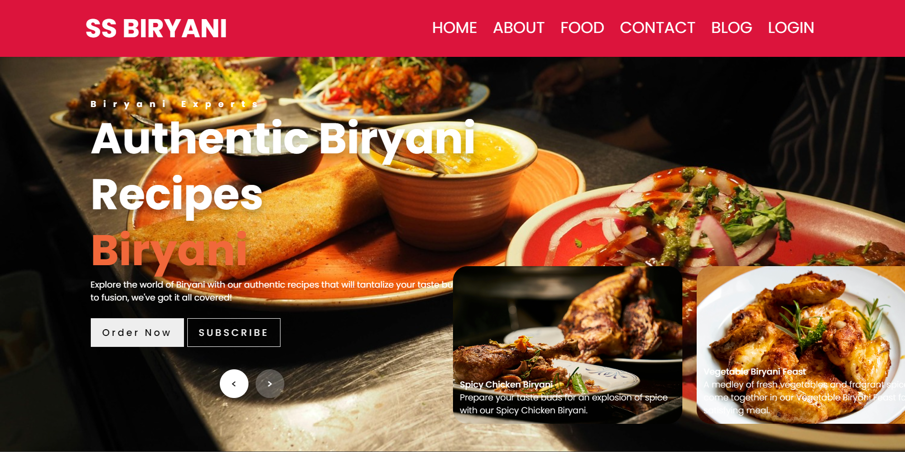
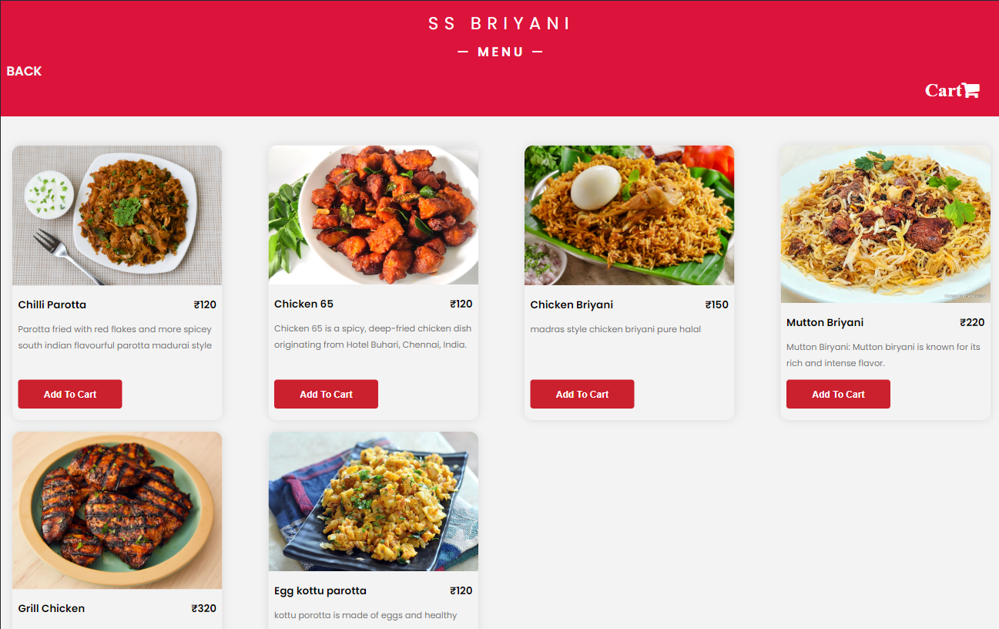
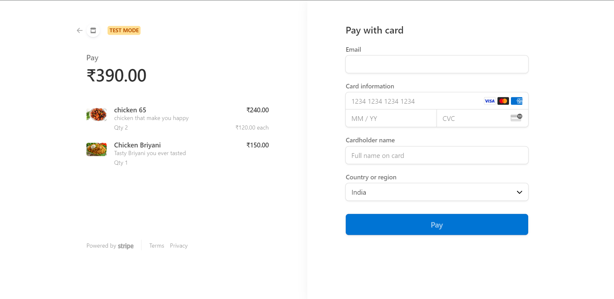

# Resturant Website with Flask and MongoDB

## Overview

This project is a fully responsive restaurant website built with Flask and MongoDB. It enables users to browse and purchase food items online. The project emphasizes secure authentication, user-friendly interfaces, and seamless integration between the frontend and backend.

## Key Features

* Fully responsive design optimized for both mobile and desktop users.
* Secure login and authentication system.
* Intuitive UI/UX for smooth user interaction.
* Admin dashboard for easily managing menu items.
* Payment gateway integration using Stripe and Flask.

## Installation Guide

Follow these steps to set up the Restaurant Website on your local machine:

1. Extract the file.
2. Drag and drop the file named foodWebsiteFlaskv4.
3. Open the terminal in the file location.
4. To create a virtual environment - `py -m venv .venv`.
5. For setting permissions - `Set-Executionpolicy -scope CurrentUser Unrestricted`.
6. To activate the environment - `.venv/Scripts/activate`.
7. To install project libraries - `pip install -r requirements.txt`.
8. To run the project - `flask run` or `python app.py`.
9. For adding sample menu items, I have attached food_website.food_items.json.

## Screenshots

## Acknowledgements

Special thanks to Shobana mam for guidance and support during the development of this project. We also acknowledge the contributions of the Flask and MongoDB communities for their excellent tools and resources.